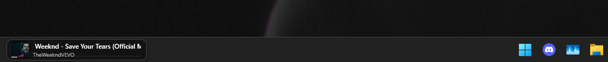
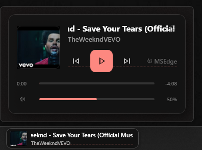
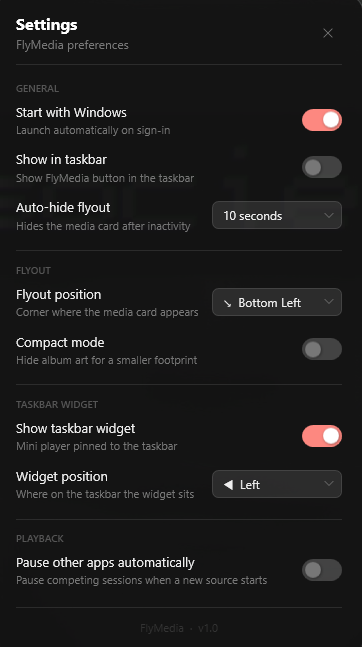

# FlyMedia

A lightweight Windows overlay that shows what's playing and lets you control it from anywhere — without switching windows.

Works with Spotify, YouTube (Chrome / Edge), VLC, Apple Music, and any app that uses the Windows media controls.

---

<p align="center">
  
</p>

<p align="center">
  
  &nbsp;&nbsp;
  
</p>

---

## Download

Go to [**Releases**](../../releases/latest) and download `FlyMedia-vX.X.X.exe` — one file, no installer, no .NET required.

**Requires:** Windows 10 / 11 (64-bit)

> **"Not commonly downloaded" warning?**
> This is normal for new apps without a paid certificate. The app is open source — you can read every line of code here.
> - Browser warning → click **Keep** → **Keep anyway**
> - SmartScreen popup → click **More info** → **Run anyway**

---

## Features

- **Album art · title · artist · source app** — always in sync
- **Prev / Play-Pause / Next** playback controls
- **Shuffle and Repeat** with accent color when active
- **Seek bar** — real-time position, click or drag to scrub
- **Per-app volume slider** — only touches the media app, Discord and everything else stay untouched
- **Global hotkey** (`Ctrl+Shift+M`) — show / hide from any app
- **Taskbar widget** — a mini bar that lives in your taskbar, always visible
- **Fullscreen auto-hide** — widget hides when you go fullscreen, peeks back up when you move the cursor to its position
- **Auto-hide** — overlay fades away after a configurable time, pauses while your mouse is on it
- **Acrylic blur** background (frosted glass)
- **Compact mode** — hides album art for a slimmer footprint
- **Pause Other Apps** — automatically pauses competing sessions when a new source takes over
- **Widget position** — snap to any corner of the screen

---

## Usage

| Action | Result |
|---|---|
| `Ctrl+Shift+M` | Show / hide the overlay |
| Left-click tray icon | Show / hide the overlay |
| Right-click tray icon | Open settings menu |
| Drag the overlay | Move it anywhere on screen |
| Click taskbar widget | Toggle the overlay above the taskbar |
| Move cursor to widget area in fullscreen | Widget peeks up — click to open controls |

---

## Build from source

**Requirements:** [.NET 8 SDK](https://dotnet.microsoft.com/download/dotnet/8) (x64), Windows 10/11

```bash
git clone https://github.com/ia7mad/FlyMedia
cd FlyMedia
dotnet run
```

**Publish a self-contained EXE:**
```bash
dotnet publish -c Release -r win-x64 --self-contained true -p:PublishSingleFile=true
```

---

## Tech stack

| | |
|---|---|
| Language | C# 12 / .NET 8 |
| UI | WPF |
| Media API | Windows SMTC (`GlobalSystemMediaTransportControlsSessionManager`) |
| Volume API | NAudio / WASAPI |
| Blur | `SetWindowCompositionAttribute` (Win32) |
| Hotkey | `RegisterHotKey` (Win32) |
| Tray | `System.Windows.Forms.NotifyIcon` |

---

## License

MIT
